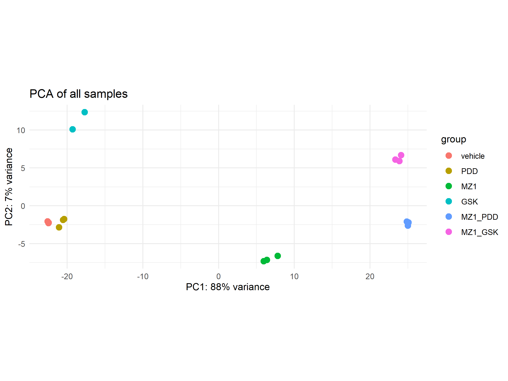
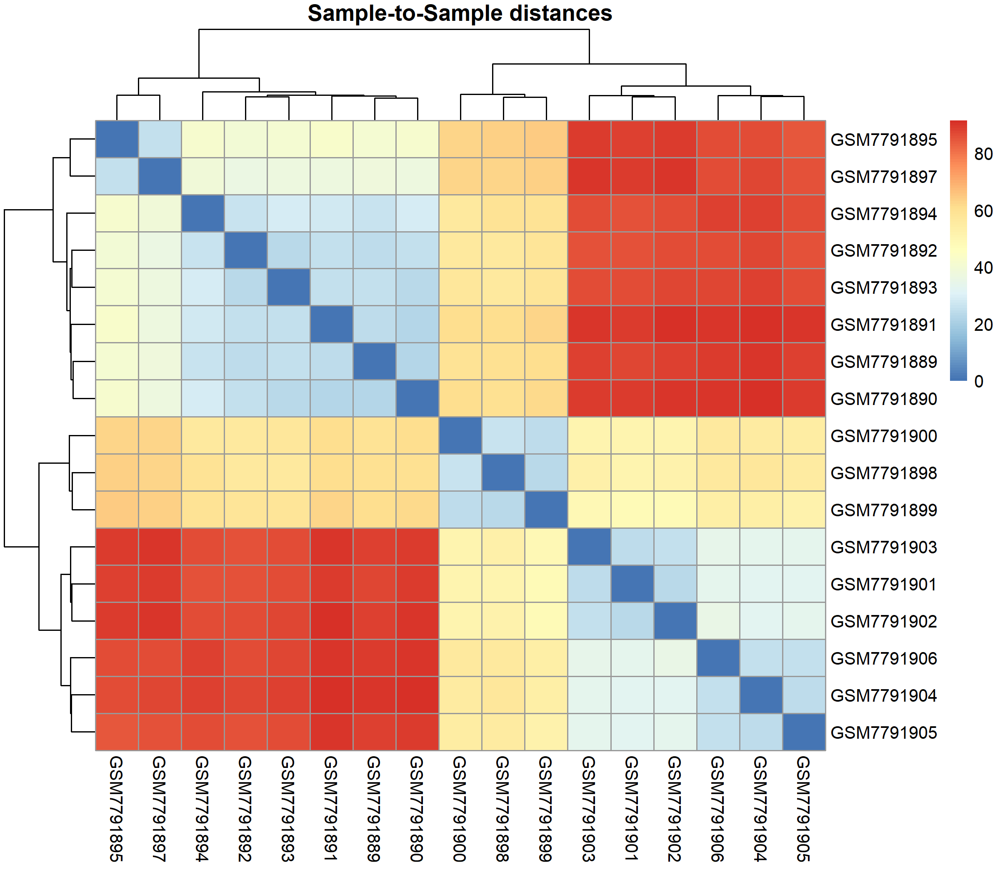

# RNA-seq Differential Expression Analysis of Single and Combination Drug Treatment (GSE243615)
Differential gene expression analysis of MZ1, PDD and GSK single drug
treatments and MZ1+PDD and MZ1+GSK combination treatments on HCT116 cells
using DESeq2 and R.

## Introduction
This project is an independent reanalysis of RNA-seq data originally 
collected and published by Mori et al. (2024):

> Mori Y, Akizuki Y, Honda R, Takao M, et al. & Ohtake F (2024).
> Intrinsic signaling pathways modulate targeted protein degradation.
> *Nature Communications*. https://doi.org/10.1038/s41467-024-49519-z

Raw count data were obtained from the NCBI Gene Expression Omnibus 
(GEO accession: [GSE243615](https://www.ncbi.nlm.nih.gov/geo/query/acc.cgi?acc=GSE243615)).

The original authors examined the transcriptional effects of the PROTAC BET
degrader MZ1 in combination with the PARG (poly(ADP-ribose) glycohydrolase)
inhibitor PDD00017273 and PERK (Protein kinase R-like endoplasmic reticulum
kinase) inhibitor GSK2606414 in HCT116 (RRID:CVCL_0291), an adherent human
colorectal carcinoma cell line widely used in cancer biology, particularly
for studying cell cycle regulation, DNA damage response, and drug
sensitivity (Rajput et al., 2008). Here I independently reproduce their
differential expression analysis using DESeq2 and extend it with GO pathway
enrichment analysis using clusterProfiler (Wu et al., 2021).

The primary study found that PDD alone did not induce significant alterations
in gene expression but enhanced the transcriptional alterations induced by
MZ1. Unlike PDD, GSK altered a distinct subset of genes irrespective of MZ1
co-treatment, while also enhancing MZ1's effects (Mori et al., 2024).

MZ1 is a PROTAC-based BET protein degrader that recruits an E3 ubiquitin
ligase and a target protein in the BET family such as BRD4, BRD3 and
BRD2 (Guo, Zheng and Peng, 2023). Interaction between the ligase and target
protein results in the ubiquitination of the target protein and subsequent
degradation via the proteasome (Guo, Zheng and Peng, 2023). Specifically,
BET proteins regulate gene transcription and chromatin architecture
(Guo, Zheng and Peng, 2023). MZ1 most potently degrades BRD4, while BRD3 and
BRD2 degradation is less efficient and may be enhanced by co-treatment with
inhibitors such as PDD and GSK (Mori et al., 2024). PDD and GSK exploit
distinct cellular stress pathways that may converge with BRD4-dependent
transcription (Mori et al., 2024). I hypothesised that co-treatment with
either compound would amplify MZ1-induced transcriptional changes,
particularly in pathways associated with chromatin remodelling, MAPK/ERK
signalling, and cell migration, producing a more widespread transcriptional
disruption than MZ1 alone (Guo, Zheng and Peng, 2023) (Tee et al., 2014).

## Methods
Raw counts were downloaded from GEO (GSE243615) and imported into R. One GSK
replicate was excluded from the raw counts matrix by the original authors,
presumably due to QC failure. GSK group therefore has 2 replicates, while
other conditions have 3. Differential expression analysis was performed using
DESeq2 with a six-level factor design formula comprising vehicle (control), 
PDD, MZ1, GSK, MZ1+PDD, and MZ1+GSK treatment groups. Log2 fold changes were
shrunk using the ashr method (Stephens, 2016). Genes were called significant
at padj < 0.05 and |log2FC| > 1. GO enrichment was performed using
clusterProfiler with Entrez gene IDs against the org.Hs.eg.db annotation
database, with Benjamini-Hochberg (BH) multiple testing correction at a
significance threshold of padj < 0.05, in order to control the false
discovery rate.

## Results

### Quality control plots:
#### Principal component analysis plot:

#### Sample-to-sample distances heat map:

### Differential Expression plots:
#### Summary:
Genes called significant at padj < 0.05 and |log2FC| > 1

|                   | total_genes|   up| down| total_sig|
|:------------------|-----------:|----:|----:|---------:|
|PDD vs vehicle     |       15045|    0|    1|         1|
|MZ1 vs vehicle     |       21317|  803| 1594|      2397|
|GSK vs vehicle     |       17733|  212|  190|       402|
|MZ1+PDD vs vehicle |       22661| 2004| 2712|      4716|
|MZ1+GSK vs vehicle |       22661| 2085| 2708|      4793|
|MZ1+PDD vs MZ1     |       20421|  673|  494|      1167|
|MZ1+PDD vs PDD     |       22213| 1919| 2491|      4410|
|MZ1+GSK vs MZ1     |       20869|  853|  642|      1495|
|MZ1+GSK vs GSK     |       22213| 1846| 2463|      4309|

#### Volcano plots:

#### Heatmaps:

#### GO enrichment dot plots:

### Key findings:
- PDD alone induced minimal transcriptional change (1 significant 
  gene vs vehicle).
- MZ1 alone produced 2,397 significant DE genes, with GO enrichment 
  identifying nucleosome assembly and ERK1/2 cascade as the most 
  enriched pathways.
- Both combination treatments approximately doubled the number of 
  DE genes compared to MZ1 alone.
- Chemotaxis and cell migration pathways were specifically enriched 
  in both combination vs single drug comparisons (MZ1+PDD vs MZ1 
  and MZ1+GSK vs MZ1) but not in MZ1 alone.
- MZ1+PDD and MZ1+GSK produced partially distinct enrichment 
  profiles beyond their shared chemotaxis signal.

## Discussion
My reanalysis found results broadly in line with those of Mori et al. (2024).
PDD alone induced minimal transcriptional changes, while MZ1 alone produced
substantial differential expression (2,397 genes), consistent with BRD4's role
as a master transcriptional regulator whose degradation disrupts broad
transcriptional programmes. Both combination treatments produced significantly
more differentially expressed genes than MZ1 alone, supporting the original 
authors' conclusion that PDD and GSK enhance MZ1-induced transcriptional
disruption, possibly due to enhanced BRD3 and BRD2 degradation. However,
the combination treatments somewhat differed in enrichment profiles,
suggesting PDD and GSK engage in different secondary stress pathways.

GO enrichment of the combination vs single drug comparisons revealed a 
consistent enrichment of chemotaxis and cell migration pathways in both
MZ1+PDD vs MZ1 and MZ1+GSK vs MZ1, which was absent in MZ1 alone. This
suggests that co-treatment with either PDD or GSK suppresses transcriptional
programmes associated with cell motility. This finding could hold clinical
relevance given the role of migration in colorectal cancer metastasis. ERK1/2
cascade pathways were consistently enriched across MZ1-containing conditions,
consistent with known roles of ERK signalling in regulating chromatin
architecture (Tee et al., 2014). Additionally, MAPK pathways were also
enriched in some conditions consistent with known BRD4 regulation of MAPK
signalling and chromatin remodelling (Guo, Zheng and Peng, 2023).

One limitation of this reanalysis is that the GSK condition has only 2 samples
following exclusion of one sample by the original authors, reducing statistical
power for GSK-containing comparisons. Additionally, GO enrichment terms such as
blood circulation and hormone regulation — which appear prominently despite
HCT116 being a colon carcinoma line — likely reflect annotation bias in the GO 
database rather than genuine biological significance, a known limitation of 
overrepresentation analysis. GSEA using the full ranked gene list could be used
in the future to overcome this bias.

## References

- Guo, J., Zheng, Q. and Peng, Y. (2023). BET Proteins: Biological Functions
  and Therapeutic Interventions. Pharmacology & Therapeutics, 243, p.108354.
  doi:https://doi.org/10.1016/j.pharmthera.2023.108354.
- Love, M.I., Huber, W. and Anders, S. (2014). Moderated estimation of fold
  change and dispersion for RNA-seq data with DESeq2. Genome Biology, 15(12),
  p.550. doi:https://doi.org/10.1186/s13059-014-0550-8.
- Mori, Y., Akizuki, Y., Honda, R., Takao, M., Tsuchimoto, A., Hashimoto, S.,
  Iio, H., Kato, M., Kaiho-Soma, A., Saeki, Y., Hamazaki, J., Murata, S.,
  Ushijima, T., Hattori, N. and Ohtake, F. (2024). Intrinsic signaling pathways
  modulate targeted protein degradation. Nature Communications, 15(1).
  doi:https://doi.org/10.1038/s41467-024-49519-z.
- Rajput, A., Dominguez San Martin, I., Rose, R., Beko, A., LeVea, C.,
  Sharratt, E., Mazurchuk, R., Hoffman, R.M., Brattain, M.G. and Wang, J.
  (2008). Characterization of HCT116 Human Colon Cancer Cells in an Orthotopic
  Model. Journal of Surgical Research, 147(2), pp.276–281.
  doi:https://doi.org/10.1016/j.jss.2007.04.021.
- Stephens, M. (2016). False discovery rates: A new deal. Biostatistics, 18(2),
  p.kxw041. doi:https://doi.org/10.1093/biostatistics/kxw041.
- Tee, W.-W., Shen, S.S., Oksuz, O., Narendra, V. and Reinberg, D. (2014).
  Erk1/2 Activity Promotes Chromatin Features and RNAPII Phosphorylation at
  Developmental Promoters in Mouse ESCs. Cell, 156(4), pp.678–690.
  doi:https://doi.org/10.1016/j.cell.2014.01.009.
- Wu, T., Hu, E., Xu, S., Chen, M., Guo, P., Dai, Z., Feng, T., Zhou, L.,
  Tang, W., Zhan, L., Fu, X., Liu, S., Bo, X. and Yu, G. (2021). clusterProfiler
  4.0: A universal enrichment tool for interpreting omics data. The Innovation,
  2(3), p.100141. https://doi.org/10.1016/j.xinn.2021.100141.

Full package citations and software versions are provided in 
[GSE243615_DESeq2_analysis.R](GSE243615_DESeq2_analysis.R),
[outputs/session_info.txt](outputs/session_info.txt) and the local session info
output.
